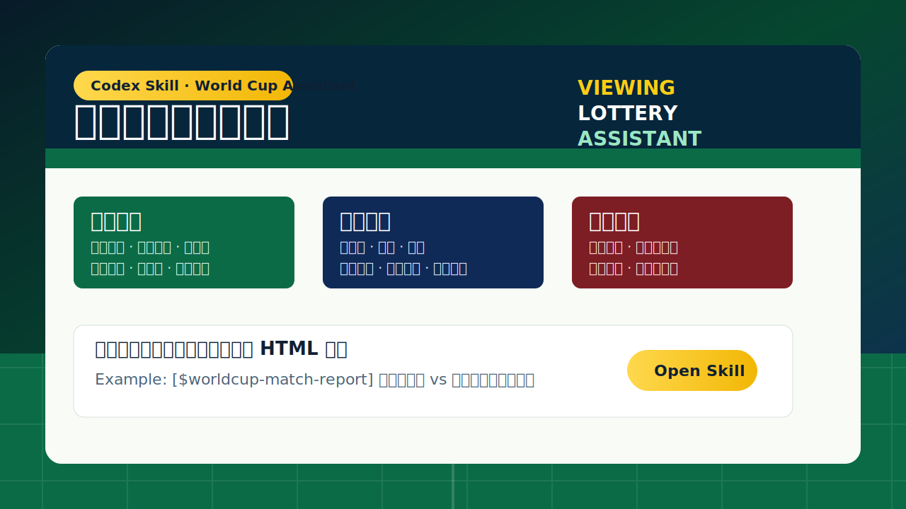

# World Cup Match Report Skill

把一场世界杯比赛，变成一份可核验、可浏览、可执行的中文赛前报告。

这个 Codex skill 面向想认真看球、又不想只凭直觉购买彩票的球迷。它会围绕一场指定比赛，主动检索球队、赛程、阵容、球员资料、历史交锋、赔率变化、战术倾向和风险因素，生成一份独立 HTML 报告：既能当观赛指南，也能作为固定预算下的体育彩票参考方案。



## 它能帮你做什么

- 生成中文 HTML 赛前报告，结构适合直接阅读、分享和复盘。
- 汇总双方球队背景、世界杯历史、分组形势、比赛时间、场馆信息和重要看点。
- 整理完整名单、教练组、球员中文名、英文名、年龄、身高、体重、号码、俱乐部、人民币身价和球员照片。
- 为每名球员生成可点击球员卡，支持首发与替补完整查看。
- 预测首发阵容和战术方向，并明确标注哪些是已核验事实，哪些是赛前推断。
- 解释胜平负、让球、大小球、比分等常见玩法和赔率含义。
- 在固定预算内生成娱乐性购彩方案，例如默认 `100 元`、`每注 2 元` 的组合分配。
- 输出来源列表，要求关键事实可追溯，降低“凭感觉判断”的比例。

## 适合谁使用

- 想在世界杯开赛前快速了解一场比赛全貌的球迷。
- 关注巴西、阿根廷、葡萄牙等强队，但不熟悉阵容和对手信息的人。
- 想把海外赔率、球队实力、战术风险和中国体育彩票执行规则放在同一份报告里对照的人。
- 想为赛前分析建立一个稳定流程，而不是每场比赛临时从多个网页拼信息的人。

## 快速开始

克隆仓库后，把 skill 安装到 Codex 的技能目录：

```bash
git clone https://github.com/asttstxh/worldcup-Viewing-Lottery-Assistant-skill.git
cd worldcup-Viewing-Lottery-Assistant-skill
bash scripts/install.sh
```

重启 Codex 后，可以这样使用：

```text
[$worldcup-match-report] 输出阿根廷 vs 阿尔及利亚分析报告
```

或者：

```text
Use $worldcup-match-report to generate a Chinese preview report for Brazil vs Morocco.
```

默认输出路径为：

```text
output/worldcup-betting-assistant/
```

## 示例

仓库中包含一份已生成的示例报告：

- [阿根廷 vs 阿尔及利亚示例 HTML](examples/argentina-vs-algeria-2026-06-17.html)

你可以直接在浏览器打开这份文件，查看最终报告的版式、球员卡、战术板、概率解释和购彩方案模块。

## 仓库结构

```text
.
├── README.md
├── LICENSE
├── CONTRIBUTING.md
├── scripts/
│   └── install.sh
├── skills/
│   └── worldcup-match-report/
│       ├── SKILL.md
│       ├── agents/openai.yaml
│       ├── references/report-spec.md
│       └── assets/known-good-brazil-vs-morocco-2026-06-14.html
├── examples/
│   └── argentina-vs-algeria-2026-06-17.html
└── docs/
    └── report-preview.svg
```

## 使用边界

这个 skill 不是投注技巧承诺，也不提供确定性收益判断。报告中的购彩方案只适合作为娱乐预算下的信息整理和风险提示。实际购买前，请务必以当地法律法规、中国体育彩票销售终端显示的固定奖金、让球数、销售状态和截止时间为准。

如果中国体育彩票接口或固定奖金无法远程核验，报告会明确标注“未核验”，并使用已核验的公开赔率与概率信息作为参考，不会把推断包装成确定事实。

## English Summary

World Cup Match Report Skill is a Codex skill for generating source-backed Chinese HTML match previews. It combines viewing guidance, squad research, player cards, tactical notes, odds explanation, risk flags, and a fixed-budget sports lottery plan. It is designed for football fans who want a clearer pre-match decision process, not guaranteed betting outcomes.
